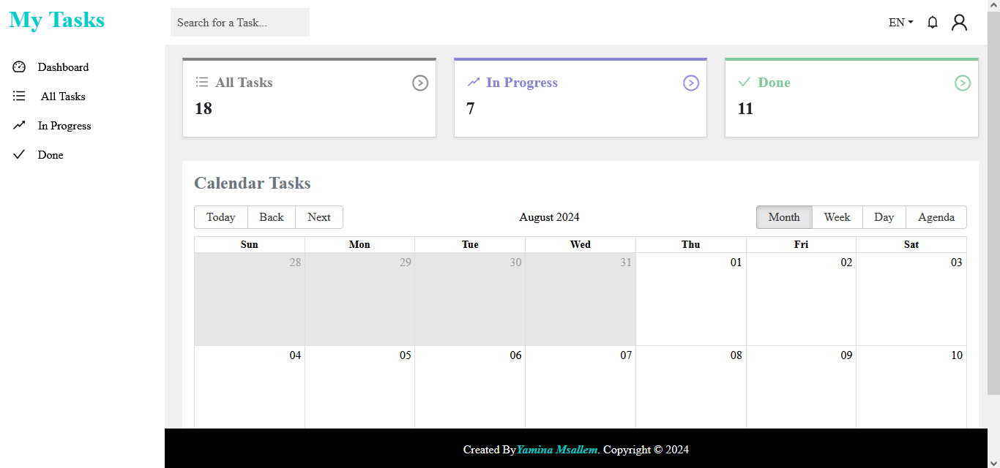
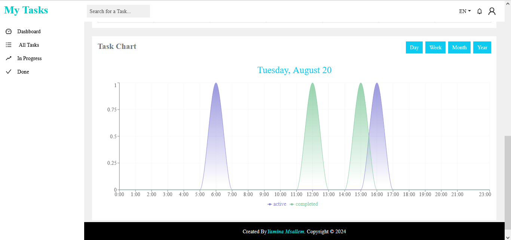
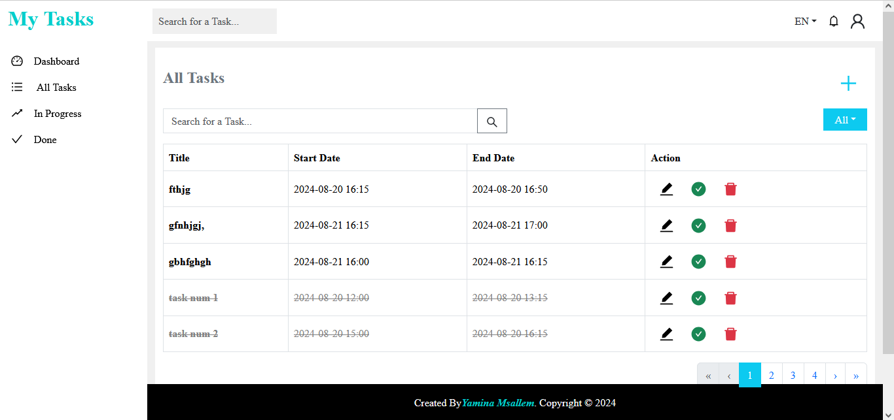

# Link 
https://Msallem-Yamina.github.io/TaskManagement-ReactJs/
# Images 

    
    
    
    
    
    
    
    
    
    

 

# Description
My Tasks is a task management application built with React.js. This app offers an interactive and user-friendly interface for managing tasks, featuring advanced functionalities such as task search, calendar views, and graphical visualizations.

# Features
    Dashboard:
        Home: Overview of tasks and statistics.
        Stats: Visualization of task data.
        Calendar: Display and manage tasks in a calendar with day, week, month, and year views.
        Charts: Detailed task charts using Recharts, displaying data by day, week, month, and year.

    Task Management:
        All Tasks: View all tasks with pagination. Add, edit, or mark tasks as complete. Includes search functionality by title and by status (active or complete).
        Completed Tasks: Display tasks marked as complete.
        Active Tasks: Display ongoing tasks.

    Internationalization: Supports translation between French and English using i18n.

    Styling and Layout: Utilizes Sass for custom styles and Reactstrap for responsive layout components.

# Technologies Used

    React.js: For building the user interface.
    React Context API: For managing global state.
    LocalStorage: For persistent user data storage.
    Sass: For managing styles and variables.
    Recharts: For data visualization through charts.
    React Big Calendar: For displaying tasks in a calendar.
    React Router: For routing and navigation.
    i18n: For translation and multi-language support.
    Reactstrap: For responsive UI components and layout.

# Getting Started with Create React App

This project was bootstrapped with [Create React App](https://github.com/facebook/create-react-app).

## Available Scripts

In the project directory, you can run:

### `npm start`

Runs the app in the development mode.\
Open [http://localhost:3000](http://localhost:3000) to view it in your browser.

The page will reload when you make changes.\
You may also see any lint errors in the console.

### `npm test`

Launches the test runner in the interactive watch mode.\
See the section about [running tests](https://facebook.github.io/create-react-app/docs/running-tests) for more information.

### `npm run build`

Builds the app for production to the `build` folder.\
It correctly bundles React in production mode and optimizes the build for the best performance.

The build is minified and the filenames include the hashes.\
Your app is ready to be deployed!

See the section about [deployment](https://facebook.github.io/create-react-app/docs/deployment) for more information.

### `npm run eject`

**Note: this is a one-way operation. Once you `eject`, you can't go back!**

If you aren't satisfied with the build tool and configuration choices, you can `eject` at any time. This command will remove the single build dependency from your project.

Instead, it will copy all the configuration files and the transitive dependencies (webpack, Babel, ESLint, etc) right into your project so you have full control over them. All of the commands except `eject` will still work, but they will point to the copied scripts so you can tweak them. At this point you're on your own.

You don't have to ever use `eject`. The curated feature set is suitable for small and middle deployments, and you shouldn't feel obligated to use this feature. However we understand that this tool wouldn't be useful if you couldn't customize it when you are ready for it.

## Learn More

You can learn more in the [Create React App documentation](https://facebook.github.io/create-react-app/docs/getting-started).

To learn React, check out the [React documentation](https://reactjs.org/).

### Code Splitting

This section has moved here: [https://facebook.github.io/create-react-app/docs/code-splitting](https://facebook.github.io/create-react-app/docs/code-splitting)

### Analyzing the Bundle Size

This section has moved here: [https://facebook.github.io/create-react-app/docs/analyzing-the-bundle-size](https://facebook.github.io/create-react-app/docs/analyzing-the-bundle-size)

### Making a Progressive Web App

This section has moved here: [https://facebook.github.io/create-react-app/docs/making-a-progressive-web-app](https://facebook.github.io/create-react-app/docs/making-a-progressive-web-app)

### Advanced Configuration

This section has moved here: [https://facebook.github.io/create-react-app/docs/advanced-configuration](https://facebook.github.io/create-react-app/docs/advanced-configuration)

### Deployment

This section has moved here: [https://facebook.github.io/create-react-app/docs/deployment](https://facebook.github.io/create-react-app/docs/deployment)

### `npm run build` fails to minify

This section has moved here: [https://facebook.github.io/create-react-app/docs/troubleshooting#npm-run-build-fails-to-minify](https://facebook.github.io/create-react-app/docs/troubleshooting#npm-run-build-fails-to-minify)
